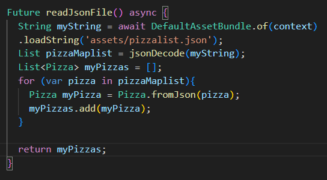

# Praktikum
## Praktikum 1
### Langkah 1

### Langkah 4

### Langkah 5

### Langkah 6

### Langkah 7

### Langkah 8

### Langkah 9

### Langkah 10

### Langkah 12

### Langkah 13

### Langkah 14

### Langkah 16

### Langkah 17

### Langkah 18

### Langkah 19

### Langkah 20

### Langkah 21

### Langkah 22

## Praktikum 2
### Langkah 1

### Langkah 2

### Langkah 4

### Langkah 5

## Ptakikum 3
### Langkah 3

### Langkah 4

### Langkah 5

### Langkah 6

### Langkah 7

### Langkah 8

### Langkah 9

### Langkah 10

### Langkah 11

### Langkah 12

### Langkah 13

### Langkah 14

### Langkah 15

## Praktikum 4
### Langkah 3

### Langkah 4

### Langkah 5

### Langkah 6

### Langkah 7

## Praktikum 5
### Langkah 2

### Langkah 3

### Langkah 4

### Langkah 5

### Langkah 6

### Langkah 7

## Praktikum 6
### Langkah 2

### Langkah 3

### Langkah 4

### Langkah 5

### Langkah 6

### Langkah 7

### Langkah 8

### Langkah 9

